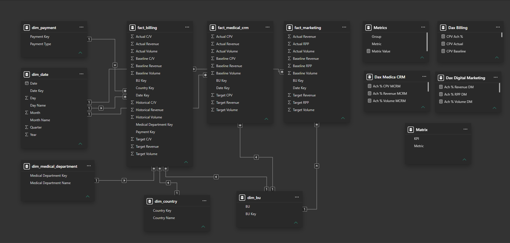

# 🏥 ANDALUSIA HEALTHCARE PERFORMANCE — POWER BI

> **Healthcare Performance Analytics | Executive BI Dashboard**

**Andalusia Healthcare Performance** is an interactive **Power BI Business Intelligence solution** developed as a portfolio project based on an interview assessment from **Andalusia Group**.

The project transforms healthcare business data into an executive-level analytical experience covering **Billing, Marketing, and Medical CRM**. It combines data preparation, Galaxy Schema modeling, Power Query, DAX, Figma-based dashboard design, and interactive Power BI reporting.

---

## 🖼️ Dashboard Experience

### High-Level Dashboard

### Data Model

---

## 🎯 Project Objective

The objective was to build a consolidated healthcare performance solution capable of answering questions such as:

- How is overall healthcare performance progressing?
- How does **Actual** performance compare with **Target** and **Baseline**?
- How does current performance compare with **Historical** values?
- Which Business Units contribute to overall performance?
- How does performance vary by Payment Type?
- How does healthcare performance change over time?
- How can Billing, Marketing, and CRM data be integrated into one analytical model?

The result is an executive-oriented BI experience designed to turn operational data into **clear KPIs, comparisons, trends, and business context**.

---

## 📊 Data at a Glance

The current repository contains **8 analytical Excel tables**:

| Type | Tables | Count |
|---|---|---:|
| 📐 Dimensions | Business Unit, Country, Date, Medical Department, Payment | **5** |
| 📊 Facts | Billing, Marketing, Medical CRM | **3** |
| 🗂️ Total analytical tables | Dimensions + Facts | **8** |

### Dataset scale

| Dataset | Records | Main analytical purpose |
|---|---:|---|
| **fact_billing** | **146** | Revenue, volume, C/V, Actual vs Target/Baseline/Historical |
| **fact_marketing** | **9** | Marketing revenue, volume, RPP and target performance |
| **fact_medical_crm** | **9** | Medical CRM revenue, volume and CPV performance |
| **Total fact records** | **164** | Combined analytical fact rows |

### Dimension coverage

| Dimension | Records |
|---|---:|
| Business Units | **3** |
| Countries | **2** |
| Dates | **3** |
| Medical Departments | **10** |
| Payment Types | **2** |

The available date dimension covers **March–May 2025**.

### Analytical domains

| Domain | Dataset |
|---|---|
| 🏥 Billing | fact_billing.xlsx |
| 📣 Marketing | fact_marketing.xlsx |
| 👥 Medical CRM | fact_medical_crm.xlsx |

### Shared dimensions

- dim_bu.xlsx — Business Units
- dim_country.xlsx — Countries
- dim_date.xlsx — Date / time analysis
- dim_medical_department.xlsx — Medical departments
- dim_payment.xlsx — Payment types

---

## 🔎 Business Analysis

The following metrics were calculated directly from the current Excel datasets in the repository. Revenue values are presented in the dataset's recorded revenue units.

### Executive Performance Snapshot

| Domain | Actual Revenue | Target Revenue | Achievement | vs Baseline |
|---|---:|---:|---:|---:|
| **Billing** | **575.19M** | **724.89M** | **79.35%** | **-18.56%** |
| **Marketing** | **72.62M** | **150.68M** | **48.19%** | **-13.02%** |
| **Medical CRM** | **74.95M** | **101.98M** | **73.49%** | **-20.40%** |

### Revenue Gaps

- **Billing:** Actual revenue is approximately **149.69M below target**.
- **Marketing:** Actual revenue is approximately **78.07M below target**.
- **Medical CRM:** Actual revenue is approximately **27.03M below target**.

### Volume Performance

| Domain | Actual Volume | Target Volume | Achievement |
|---|---:|---:|---:|
| **Billing** | **174,824** | **243,620** | **71.76%** |
| **Marketing** | **54,295** | **110,951.64** | **48.94%** |
| **Medical CRM** | **39,604** | **57,635** | **68.72%** |

### Billing Analysis

Billing contains **146 fact rows** across the available business dimensions.

Key observations from the calculated data:

1. **Billing revenue achievement is 79.35%**, leaving a revenue gap of approximately **149.69M** versus target.
2. Actual billing revenue is **18.56% below baseline revenue**.
3. Billing volume reached **71.76% of target volume**, with an observed gap of **68,796** units.
4. **AMH** generated the largest share of billing actual revenue at approximately **40.93%**, followed by **ASH at 32.67%** and **HJH at 26.40%**.
5. Among the billing medical departments, **Inpatient** generated approximately **150.91M** in actual revenue, followed by **Outpatient at 144.25M** and **ICU at 115.07M**.
6. Billing revenue was distributed primarily through **Credit**, which accounted for approximately **490.07M** of actual revenue, compared with **85.13M** through Cash.

### Marketing Analysis

Marketing contains **9 fact rows** and focuses on revenue, volume, RPP and target comparison.

- Actual marketing revenue reached **72.62M** against a target of **150.68M**, equivalent to **48.19% achievement**.
- The revenue gap to target is approximately **78.07M**.
- Actual marketing volume reached **48.94% of target volume**.
- Actual marketing revenue was **13.02% below baseline revenue**.

### Medical CRM Analysis

Medical CRM contains **9 fact rows** and focuses on revenue, volume and CPV performance.

- Actual CRM revenue reached **74.95M** against a target of **101.98M**, equivalent to **73.49% achievement**.
- The revenue gap to target is approximately **27.03M**.
- Actual CRM volume reached **68.72% of target volume**.
- Actual CRM revenue was **20.40% below baseline revenue**.

### Business Interpretation

The dataset highlights several areas for management investigation:

1. **Target attainment:** All three analytical domains are below their revenue targets in the current dataset.
2. **Marketing performance gap:** Marketing shows the lowest revenue achievement at **48.19% of target**.
3. **Billing scale:** Billing represents the largest revenue domain in the available data, with **575.19M actual revenue**.
4. **Business Unit concentration:** AMH contributes approximately **40.93%** of billing actual revenue.
5. **Payment mix:** Credit represents the majority of billing actual revenue in the recorded data.
6. **Department concentration:** Inpatient, Outpatient and ICU are the largest billing revenue contributors among the medical departments shown.
7. **Benchmark comparison:** Actual performance is below both target and baseline across the three fact domains, although the size of the gap differs by domain.

> **Important:** These are descriptive observations from the current dataset. They indicate where performance gaps and concentration exist; they do not establish causal relationships.

---

## 🔄 End-to-End BI Workflow

~~~
Raw Healthcare Data
        ↓
Excel Data Exploration
        ↓
Data Cleaning & Validation
        ↓
Power Query
        ↓
Galaxy Schema Data Model
        ↓
DAX Measures
        ↓
Power BI
        ↓
Interactive Executive Dashboard
        ↓
Business Performance Analysis
~~~

### Data Preparation

The source data was explored and prepared before being modeled in Power BI.

The preparation workflow included:

- Identifying missing values
- Reviewing data consistency
- Reviewing potential outliers
- Standardizing analytical fields
- Preparing data for modeling

### Power Query

Power Query was used for:

- Data type standardization
- Data transformation
- Data cleaning
- Removing unnecessary fields
- Preparing analytical tables

### DAX

DAX measures were developed for analytical KPIs including:

- Actual
- Target
- Baseline
- Historical
- Achievement %
- Growth %
- Revenue KPIs
- Operational KPIs

---

## 🗂️ Data Model

The project uses a **Galaxy Schema**, with multiple fact tables connected through shared dimensions.

### Model Structure

~~~
                    ┌────────────────────┐
                    │    dim_date        │
                    └─────────┬──────────┘
                              │
┌──────────────┐     ┌────────▼─────────┐     ┌──────────────┐
│   dim_bu     │────►│ Shared Dimensions│◄────│ dim_country  │
└──────────────┘     └────────┬─────────┘     └──────────────┘
                              │
          ┌───────────────────┼───────────────────┐
          │                   │                   │
   ┌──────▼──────┐     ┌──────▼──────┐     ┌──────▼─────────┐
   │fact_billing │     │fact_marketing│    │fact_medical_crm│
   └─────────────┘     └─────────────┘     └────────────────┘
~~~

Additional shared dimensions include:

- Medical Department
- Payment Type

This architecture supports:

- Cross-domain analysis
- Consistent filtering
- Reusable dimensions
- Scalability
- Maintainability
- Clear separation of analytical grain

---

## 📈 Dashboard Features

### Executive KPIs

The dashboard provides KPI-level visibility into:

- Actual
- Target
- Baseline
- Historical
- Achievement %
- Growth %

### Interactive Analysis

Users can analyze the report through:

- Business Unit filtering
- Country filtering
- Payment Type filtering
- Medical Department filtering
- Month/date analysis
- Actual vs Target comparison
- Actual vs Baseline comparison
- Historical performance comparison
- Interactive matrix analysis

---

## 🎨 Dashboard Design

The dashboard was designed from an **executive BI perspective**, focusing on information hierarchy and efficient decision support.

The design process considered:

- KPI hierarchy
- Visual hierarchy
- Executive readability
- Consistent layout
- Interactive filtering
- Business-oriented storytelling
- Clear benchmark comparisons

**Figma** was used during the dashboard design stage before implementation in Power BI.

---

## 🧠 Analytical Challenges

### Multi-domain integration

Billing, Marketing, and Medical CRM have different analytical purposes. The Galaxy Schema provides a common structure for analyzing them through shared dimensions.

### Multiple performance benchmarks

The dashboard distinguishes between:

**Actual → Target → Baseline → Historical**

This makes it possible to evaluate current performance from several business perspectives.

### Time-based analysis

The dedicated date dimension supports period-based analysis and historical comparisons.

### Executive communication

The challenge was not only to calculate KPIs, but to present them in a format where performance, gaps, and trends can be understood quickly.

---

## 🛠️ Technology Stack

| Technology | Role |
|---|---|
| 📊 **Power BI Desktop** | Data modeling, visualization, and dashboard development |
| 🔄 **Power Query** | Data transformation and preparation |
| 🧮 **DAX** | Dynamic measures and KPI calculations |
| 📗 **Microsoft Excel** | Source data and analytical tables |
| 🎨 **Figma** | Dashboard UI/UX planning |
| 🗂️ **Galaxy Schema** | Analytical data model architecture |

---

## 📁 Repository Structure

~~~
Andalusia-Dashboard/
│
├── Andalusia.pbix
│   └── Complete Power BI report
│
├── Dataset/
│   ├── dim_bu.xlsx
│   ├── dim_country.xlsx
│   ├── dim_date.xlsx
│   ├── dim_medical_department.xlsx
│   ├── dim_payment.xlsx
│   ├── fact_billing.xlsx
│   ├── fact_marketing.xlsx
│   └── fact_medical_crm.xlsx
│
├── Screenshots/
│   ├── High Level Dashboard.png
│   └── Model.png
│
└── README.md
~~~

---

## 📚 Data Source

The project is based on data provided for an **Andalusia Group interview assessment**.

The cleaned analytical tables are included in the repository under the **Dataset** folder.

The Power BI report is included as:

**[Andalusia.pbix](./Andalusia.pbix)**

---

## 🎓 Project Context

This project demonstrates an end-to-end **Data Analyst / BI Developer** workflow:

**Data Preparation → Data Modeling → Power Query → DAX → Dashboard Design → Business Analysis**

The project focuses on translating business requirements into an analytical solution that allows executives to monitor performance, compare benchmarks, investigate trends, and explore different business dimensions.

---

## 👤 Author

**Kerelos Nakhla Saad**

**Data Analyst | BI Developer**

- GitHub: [Kerelos-Nakhla](https://github.com/Kerelos-Nakhla)
- LinkedIn: [Kerelos Nakhla](https://www.linkedin.com/in/kerelos-nakhla/)

---

## 📌 Repository Files

| File / Folder | Description |
|---|---|
| [Andalusia.pbix](./Andalusia.pbix) | Complete Power BI report |
| [Dataset](./Dataset) | Structured analytical Excel tables |
| [Screenshots](./Screenshots) | Dashboard and data-model screenshots |
| [README.md](./README.md) | Project documentation |

---

⭐ **Explore the repository to review the dashboard, data model, analytical tables, and complete Power BI implementation.**
